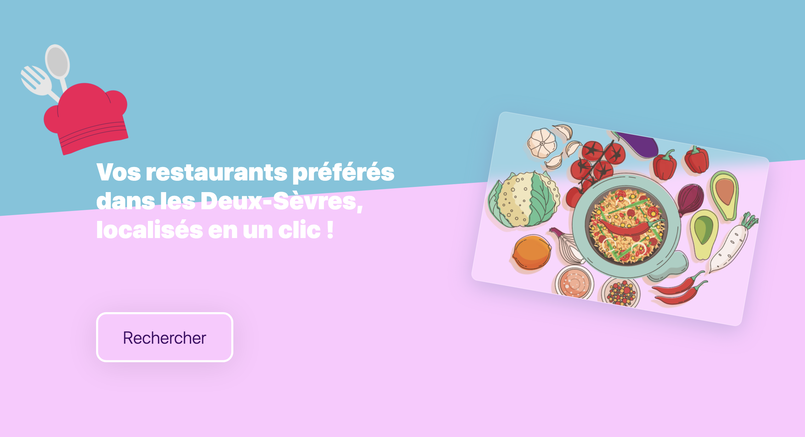

## Terms of reference

The platform should list a few restaurants in a few towns in the Deux-Sèvres and allow the user to give a rating (from 1 to 5). We are talking about a maximum of ten restaurants in all.

Main objectives:

- Set up authentication with Firebase
- Store restaurant data in Firestore
- Restore restaurant data in a user-friendly way
- Take into account new ratings

Objectifs secondaires:

- Responsive platform on 10'' tablet and PC
- Put a search bar in place on the restaurants page

Project duration:

- 1 week



## Getting Started

First, run the development server:

```bash
npm run dev
# or
yarn dev
```

## Deploy on Vercel

Web site : [Link](https://restaurant-deux-sevres.vercel.app/)
